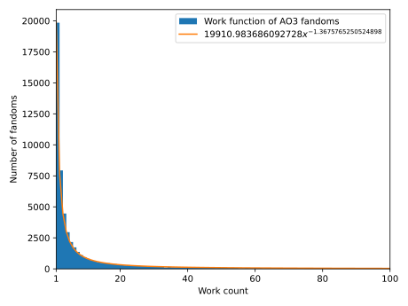

A python program to generate a graph showing the work distribution of AO3 and a power function approximating it. Thank you to  for saving me from having to learn web scraping.

Uses the  because I bashed this out in around an hour and is therefore probably awful code.

### Dependencies
----------------------
* 
* 
* 
